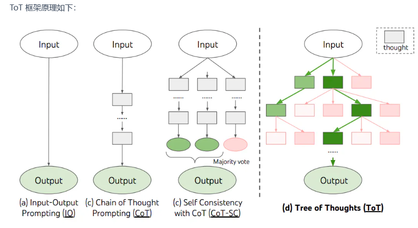

# I. 提示词包含要素：

指令：想要模型执行的特定任务或指令。**（放在开头）**

上下文：包含外部信息或额外的上下文信息，引导语言模型更好地响应。

输入数据：用户输入的内容或问题。**（`###`或者`"""`包裹）**

输出指示：指定输出的类型或格式。

### 例子：
**提示：**

`提取以下文本中的地名。（指令）
所需格式：
地点：<逗号分隔的公司名称列表> （输出指示）
输入：“虽然这些发展对研究人员来说是令人鼓舞的，但仍有许多谜团。里斯本未知的香帕利莫德中心的神经免疫学家 Henrique Veiga-Fernandes 说：“我们经常在大脑和我们在周围看到的效果之间有一个黑匣子。”“如果我们想在治疗背景下使用它，我们实际上需要了解机制。””

**输出：**

地点：里斯本，香帕利莫德中心

# II. 技巧
1. 别一开始就全加上，从zero-shot开始
2. 少用形容词限定（简洁x, 2-3句话v）
3. 在最后加一个leading word
4. 创建几个模拟对话先（few shot）
5. 同时在每一个样本回答时<u>指定解决问题的步骤!</u>（弥补少样本对于推理的不足）(CoT)
6. 若是零样本就写`let's think step by step`
7. 尝试多个推理路径(Self Consistency with CoT)
8. 添加不误导的知识
9. 链式提示-将上个回答作为下一输入（用特定标志）
10. 思维树（ToT）同时使用不同搜索算法

11. 自动提示工程师（APE）- 黑盒特性自动生成候选提示，再评估
12. Active-Prompt：
    a. 第一步是使用或不使用少量 CoT 示例查询 LLM。
    b. 对一组训练问题**生成 k 个可能**的答案。
    c. 基于 k 个答案计算不确定度度量（使用不一致性）。选择**最不确定的问题**由人类**进行注释**。
    d. 然后**使用新的注释范例来推断每个问题**。

## 例子：<u>文本分类</u>
Classify the text into neutral, negative or positive. // 将文本按中立、负面或正面进行分类
Text: I think the food was okay. 
**Sentiment:**

指定回答单词格式（小写）
Classify the text into neutral, negative or positive. 
Text: I think the vacation is okay.
Sentiment: neutral 
Text: I think the food was okay. 
Sentiment:
